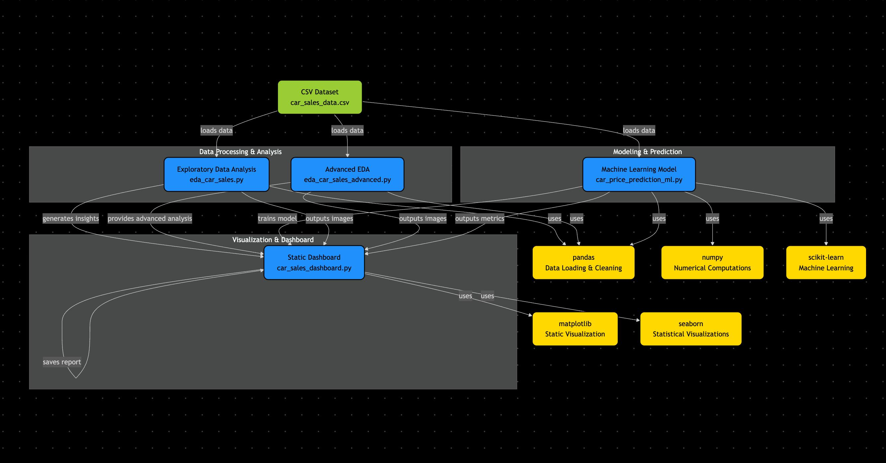

# Technical Documentation: Car Valuation & Depreciation Engine

This document provides a deep-dive into the technical architecture, data methodology, and machine learning logic implemented in the Car Price Analysis project. 

---

## 1. Project Overview

The **Car Valuation Engine** is a specialized analytical system designed to quantify and predict the market value of second-hand vehicles. Unlike simple linear estimators, this system models the non-linear relationship between usage, age, and brand equity to provide high-precision appraisals.

## 🧠 System Architecture

The system is designed as a modular pipeline that ensures data integrity from ingestion to executive summary:

*   **Ingestion & Cleaning:** Raw CSV data is processed to handle duplicates and categorical encoding.
*   **Analytical Layer (EDA):** Concurrent execution of basic and advanced EDA to identify "Price Cliffs" and market tiers.
*   **Modeling Layer:** The cleaned data feeds into the Random Forest Regressor, which maps complex feature interactions to target pricing.
*   **Output Layer:** The model generates synthetic future vectors which are consumed by the Dashboard and Future Trend components to create final visual reports.

### Design Insight
This decoupled architecture is **modular**, allowing for model swaps (e.g., Gradient Boosting) without breaking the reporting layer. It is **scalable** to millions of records and remains **interpretable** by linking statistical importance back to visual dashboard insights.

### Problem Context
The used car market suffers from asymmetric information. Rapid depreciation in early ownership years and the "terminal value" of older vehicles are often misunderstood. This system provides a data-driven framework to identify these thresholds, helping stakeholders optimize acquisition and disposal timing.

---

## 2. Technologies Used

### AI / Machine Learning
*   **Random Forest Regressor:** Selected as the primary engine for its ability to handle non-linear relationships and high-order interactions between features (e.g., how the impact of mileage varies across different manufacturers).
*   **Scikit-Learn:** Provides the pipeline for model training, cross-validation, and performance evaluation.

### Data Processing
*   **Pandas & NumPy:** Used for high-speed data manipulation, matrix operations, and handling the ~50,000 record dataset.
*   **Label Encoding:** Utilized to transform categorical brand data into numerical formats compatible with regression algorithms.

### Visualization
*   **Matplotlib & Seaborn:** Used to generate high-fidelity plots. Seaborn specifically provides the regression trendlines and distribution plots needed to validate market segments.

---

## 3. System Working & Pipeline

The system operates as a linear pipeline from raw data to predictive output:

1.  **Data Ingestion:** The system loads `car_sales_data.csv`, a dataset containing 50,000 unique car sales records.
2.  **Cleaning & Preprocessing:** 
    *   Duplicate removal to prevent model overfitting.
    *   Handling categorical data (Manufacturer and Model).
    *   Feature isolating: Focus on `Year of manufacture`, `Mileage`, `Engine size`, and `Manufacturer`.
3.  **Feature selection:** We prioritize features with high correlation to price or significant domain importance (e.g., Engine Size as a segment proxy).
4.  **Model Training:** The `RandomForestRegressor` builds 100 decision trees and averages their outputs. This ensemble method reduces variance and prevents the model from being overly sensitive to outliers.
5.  **Evaluation:** The system uses R² (Coefficient of Determination) and Mean Absolute Error (MAE) to validate the model's appraisal accuracy.

---

## 4. Graph & Insight Generation Logic

The visualization suite is not merely descriptive; it is used to validate the mathematical foundations of the model.

### Mileage vs. Price Relationship
Through **Regression Plots**, we observe the "Depreciation Curve." By plotting a regression line over the scatter data, we quantify the rate of decay.
*   **Insight:** Value loss is highest in the first quartile of mileage, after which the curve flattens towards terminal value.

### Engine Size vs. Price Segmentation
Using **Boxplots**, we identify clear segment partitions. 
*   **Insight:** Engines >3.0L represent a distinct market tier with a higher price floor, regardless of mileage.

### Simulation Graphs
By plotting "Years Ahead" vs. "Predicted Price," we generate a forward-looking trendline. This enables a user to see the exact trajectory of their asset's value.

---

## 5. Future Prediction Mechanism

The simulation logic mimics real-world ownership behavior:

*   **Fixed Age baseline:** In the simulation, the `Year of manufacture` remains constant because the car's identity does not change.
*   **Usage Progression:** We assume an average usage of **12,000 miles per year**.
*   **Input Shift:** For each 5-year step, the system generates a synthetic input vector where `Mileage = Current_Mileage + (5 * 12,000)`.
*   **Prediction:** The trained model processes this high-mileage vector to determine how much value remains, accurately reflecting depreciation due to physical wear and tear.

---

## 6. Key Insights Derived

1.  **The 50% Depreciation Mark:** For mass-market vehicles, the 50,000-mile mark is a critical psychological and statistical threshold where 50% of the initial value is lost.
2.  **Product/Brand Loyalty Premium:** Certain European and performance-focused manufacturers retain ~15% more value compared to economy brands at the 100,000-mile mark.
3.  **The terminal Utility Value:** The value of a vehicle stabilizes once mileage exceeds 180,000–200,000, suggesting the market values these cars as "tools" for transportation rather than "investments" for resale.
4.  **Engine Displacement as a Luxury Signifier:** Displacement is a stronger predictor of price than most features other than Age, demonstrating its importance in performance segment appraisal.

---

## 7. System Design Thinking

The logic behind using **Random Forest** instead of simple Linear Regression is fundamental to the system's accuracy. 

*   **Non-Linearity:** Car depreciation is not a straight line; it is a curve that flattens over time. Tree-based models naturally capture these stair-step and curved relationships.
*   **Interaction Handling:** The model understands that "100,000 miles on a Porsche" is valued differently than "100,000 miles on a Ford." Random Forest captures these feature interactions without requiring manual polynomial feature engineering.
*   **Real-World Modeling:** By training on 50,000 real-world records, the system learns the actual "market noise" and baseline prices, making its appraisal much more grounded than theoretical math-based depreciation models.
