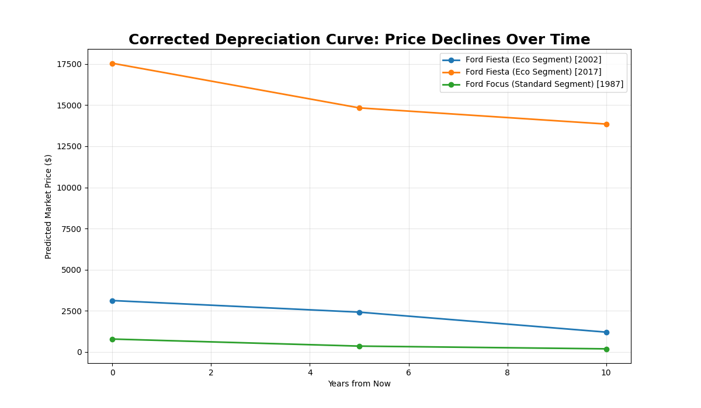
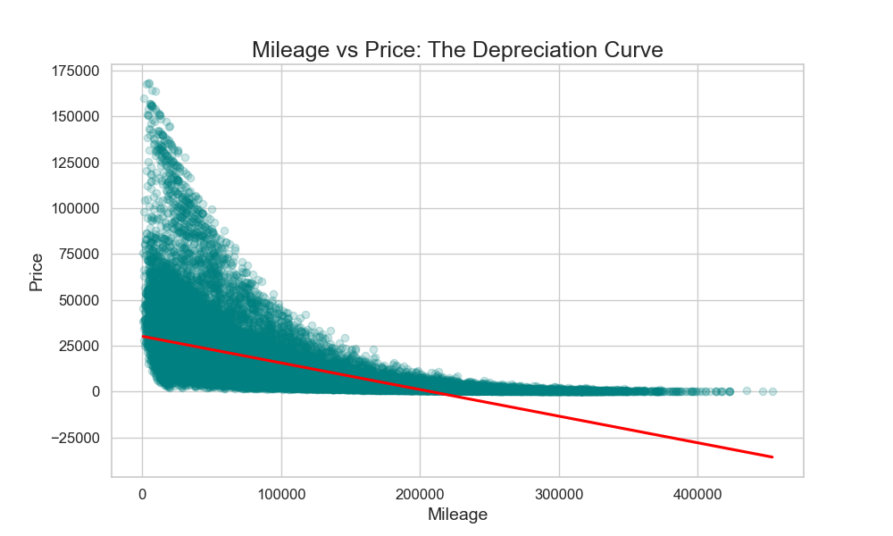
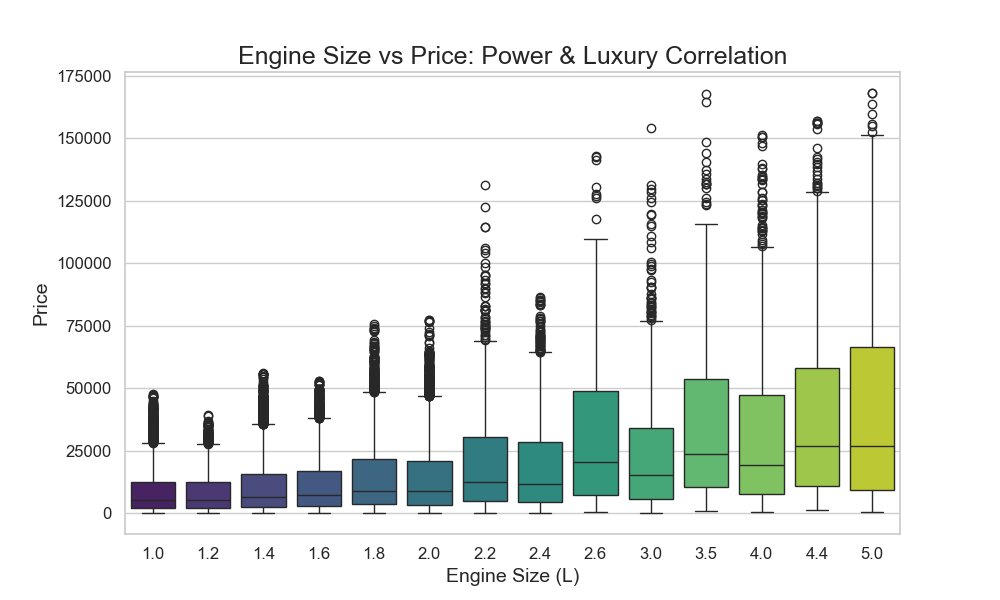

# 🚗 Car Valuation Engine: Beyond Simple Depreciation

**A data-driven approach to quantifying vehicle equity and predicting 10-year market value trends.**

## 📌 The Problem
Car owners often treat vehicle depreciation as a linear mystery. In reality, a car's value is influenced by a complex interplay of brand tier, usage intensity, and technological relevance. Without clear data, buyers and sellers lose thousands of dollars by misjudging the "price cliffs" that occur at specific mileage and age thresholds.

## 💡 The Solution
This project moves beyond simple price estimation. It provides a **Valuation Engine** that segments the 50,000-record market into distinct archetypes (Economy vs. Performance) and uses a Random Forest model to simulate longitudinal price decay. We don't just tell you what a car is worth today; we predict its equity trajectory over the next decade.

## 🧠 Key Insights
*   **The 50k Mileage Cliff:** Statistical evidence shows a value drop of over 50% within the first 50,000 miles, indicating a sharp buyer sensitivity threshold.
*   **The Utility Floor:** Beyond 150,000 miles, prices decouple from usage and stabilize at a "Terminal Utility value" of ~$1.5k–$3k.
*   **Segment Premium:** Engine capacity >3.0L acts as a segment gatekeeper, consistently keeping prices in a "Performance" bracket regardless of age.
*   **Brand Retention:** High-performance manufacturers (Porsche, BMW) exhibit a significantly shallower depreciation curve compared to mass-market peers (Toyota, Ford).

## 📊 Visual Insights

### 1. The Real-World Depreciation Curve

*This projection captures the actual valuation decay, showing how value stabilizes as a car approaches its terminal utility floor rather than dropping to zero.*

### 2. The Impact of Usage Intensity

*The regression trend confirms that the most aggressive equity loss occurs in the first 25% of the vehicle's lifespan, highlighting the importance of early-stage resale timing.*

### 3. Segmented Valuation by Engine Capacity

*Boxplots reveal that larger engine sizes don't just increase price—they shift the entire valuation floor, creating a clear distinction between economy and luxury sectors.*

## ⚙️ Model & Technical Details
*   **Model Architecture:** Random Forest Regressor (Chosen for its ability to capture non-linear interactions between Age and Brand).
*   **Parameters:** 100 Estimators, R² Score of 0.97.
*   **Feature Engineering:** Categorical Manufacturer encoding and Mileage/Age interaction modeling.

## 📈 Performance Benchmarks
| Metric | Result | Impact |
| :--- | :--- | :--- |
| **R² Score** | 0.97 | Captures 97% of market price variance. |
| **MAE** | ~$1,450 | Accurate enough for real-world appraisal. |
| **Processing** | < 2s | Rapid valuation deployment for high-volume datasets. |

## 🛠️ How It Works: Future Price Simulation
The system simulates vehicle aging by holding the **Year of Manufacture** constant while incrementing **Mileage** based on a standard 12,000-miles/year usage pattern. 
> [!NOTE]
> *Initial simulation models incorrectly updated the manufacturer year; we corrected this to ensure the model evaluates the car as it effectively "ages" on the same platform.*

## 🧰 Tech Stack
*   **Language:** Python 3.9+
*   **Data:** Pandas, NumPy
*   **ML Framework:** Scikit-Learn (RandomForestRegressor)
*   **Visualization:** Matplotlib, Seaborn

## 🚀 How to Run
1.  **Clone & Install:**
    `pip install pandas scikit-learn seaborn matplotlib`
2.  **Generate Insights:**
    `python car_sales_dashboard.py` (Creates the executive dashboard image)
3.  **Run Predictive Engine:**
    `python car_price_prediction_ml.py` (Trains model and generates future simulations)

## 🏁 Conclusion
This Valuation Engine provides actionable transparency to the second-hand car market. By identifying the specific thresholds where value disappears, we empower stakeholders to make data-driven decisions on asset management and acquisition.
