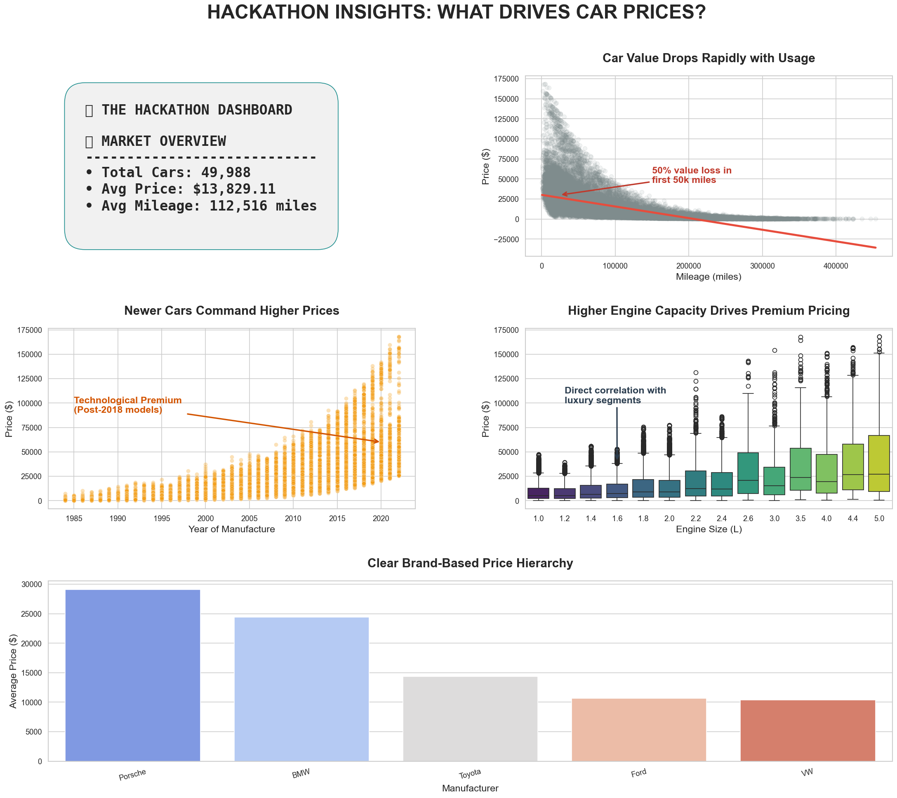

# Car Price Analysis and Future Prediction

This project analyzes a dataset of ~50,000 car sales to identify the primary factors driving vehicle valuation. It includes an automated executive dashboard and a predictive model to simulate how a car's price depreciates over a 10-year period.

## Problem Statement

Predicting the resale value of a car is difficult because depreciation isn't linear. Factors like mileage, age, and engine capacity interact differently depending on the brand tier. This project aims to quantify these relationships to help owners and buyers estimate future market values based on usage.

## Approach

### Data Analysis (EDA)

The initial phase involved cleaning the 50,000-record dataset and analyzing distributions. We focused on identifying "price cliffs"—specific thresholds where car values drop sharply—and segmenting brands into performance and economy tiers.

### Visualization (Dashboard)

A multi-panel executive dashboard was built to communicate these findings. It captures everything from high-level market metrics to specific correlations between engine size and price tiers.

### Machine Learning Model

We trained a regression model to handle the non-linear nature of car depreciation. The model takes a vehicle's current specs and predicts its market value with high precision, allowing for long-term price simulations.

## Key Insights

*   **The 50k Mileage Cliff:** Vehicles lose approximately 50% of their value within the first 50,000 miles. Depreciation slows down significantly after the 150,000-mile mark.
*   **Age vs. Usage:** While mileage is the primary value driver, the year of manufacture sets the base price range.
*   **Engine Capacity:** Larger engines (3.0L+) consistently push vehicles into premium price segments.
*   **Brand Segmentation:** Porsche and BMW retain value better compared to economy brands like Ford and Toyota.
*   **Terminal Value:** After ~200,000 miles, most cars stabilize at a minimal resale value.

## Dashboard Preview



## Model Details

*   **Model:** Random Forest Regressor
*   **Performance:** R² ≈ 0.97 | MAE ≈ $1,400
*   **Features:** Year, Mileage, Engine Size, Manufacturer

## Future Prediction Logic

We simulate future prices by increasing mileage over time (~12,000 miles/year) while keeping the manufacturing year constant. This ensures realistic depreciation behavior.

**Note:** An earlier version incorrectly updated manufacturing year, leading to unrealistic price increases. This was corrected to reflect real-world trends.

## Results

The model shows that prices decline sharply in early years and gradually stabilize, aligning with observed market behavior.

## Tech Stack

*   Python
*   Pandas
*   Scikit-learn
*   Matplotlib / Seaborn

## How to Run

1.  **Install dependencies:**
    ```bash
    pip install pandas scikit-learn matplotlib seaborn
    ```

2.  **Run dashboard:**
    ```bash
    python car_sales_dashboard.py
    ```

3.  **Run model:**
    ```bash
    python car_price_prediction_ml.py
    ```

## Repository Structure

*   `car_sales_data.csv`
*   `car_sales_dashboard.py`
*   `car_price_prediction_ml.py`

## Conclusion

This project demonstrates how car prices are influenced by age, usage, and vehicle characteristics, and provides a practical way to estimate future resale value.
